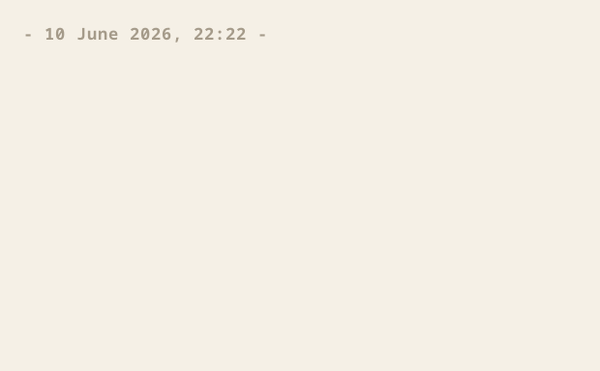

# Eternal Typewriter

A bare-metal x86_64 Rust kernel that boots straight into a typewriter. It
shows you a blank page and waits. Whatever you type joins one long scroll that
is written to disk as you go and is still there after a reboot, a power cut, or
a year in a drawer. You cannot edit it. There is no filesystem, no settings,
and no cursor keys that do anything useful.



Built with Claude Code: roughly 1,500 lines of Rust over 20 commits, across two
sessions. Verified in QEMU; it has not been run on real hardware yet.

## Running it

You need [rustup](https://rustup.rs) and QEMU. The nightly toolchain, the
`x86_64-unknown-none` target, and the components it needs install themselves from
`rust-toolchain.toml` the first time you build, so the only things to install by
hand are QEMU (`brew install qemu`, or your system's package manager) and, for
the helper scripts, python3.

```
cargo run
```

This builds the kernel, creates a blank 50 MB `scroll.img` on first run, and
opens a QEMU window. Click in and type. To read a scroll back as plain text
without booting:

```
python3 scripts/extract.py scroll.img
```

## Using it

Type, and the characters appear as ink at the end of the scroll. Press Enter for
a new line. That is most of the interface. The rest:

| Key | What it does |
| --- | --- |
| Page Up / Page Down | Move back and forth through everything you have written. Read-only; the moment you type a character you snap back to the end and write there. |
| F12 | Print the whole scroll out the serial port. |

On a Mac laptop without dedicated keys, Page Up and Page Down are fn with the up
and down arrows. Backspace, Escape, and the arrow keys on their own do nothing.
The ink is dry before you lift your finger.

## How it works

The scroll lives on a second ATA disk as an append-only log of 512-byte
records. Each record carries a CRC and its own sector number, so a half-finished
write can never corrupt the prose before it. Boot reads the tail first and
paints it in well under a second even on a large scroll, then the older history
streams in behind you while you type. That disk image is the entire document.
Copy it to back up your writing, or delete it to start a fresh scroll.

## Built on

The kernel does not ship its own bootloader; the `bootloader` crate loads it and
hands over a memory map and a framebuffer. From there it leans on small crates
for the parts that look the same in every kernel: the `x86_64` register and table
types, the 8259 PIC, PS/2 scancode decoding, a 16550 serial port, a linked-list
heap, and a bitmap font. The hand-written parts are the GDT and interrupt setup,
the keyboard controller bring-up, the frame allocator, the ATA disk driver, the
renderer, and the append-only scroll on disk.

## What was awkward

A few things only broke once the kernel met a real bootloader and BIOS. The GDT
had to reload the stack segment or the first timer interrupt triple-faulted. The
first frame allocator was accidentally quadratic and took minutes to map the
heap. The keyboard stayed silent until the i8042 controller was set up by hand,
since SeaBIOS under QEMU does not leave it scanning. The commit history has the
gory version of each.

## Tests

```
cargo test -p scroll-core   # record format, CRC, and layout
./scripts/e2e_test.sh        # boots, types, reboots, checks the words survived
```

## License

Public domain under CC0 1.0. Do whatever you like with it.
